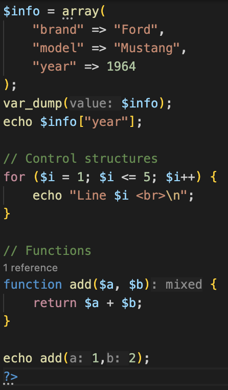
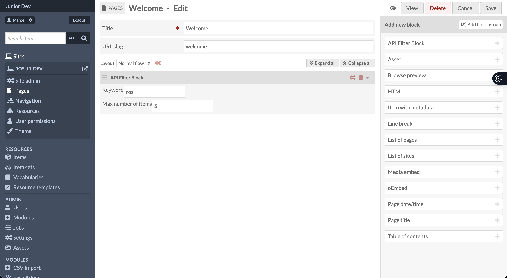
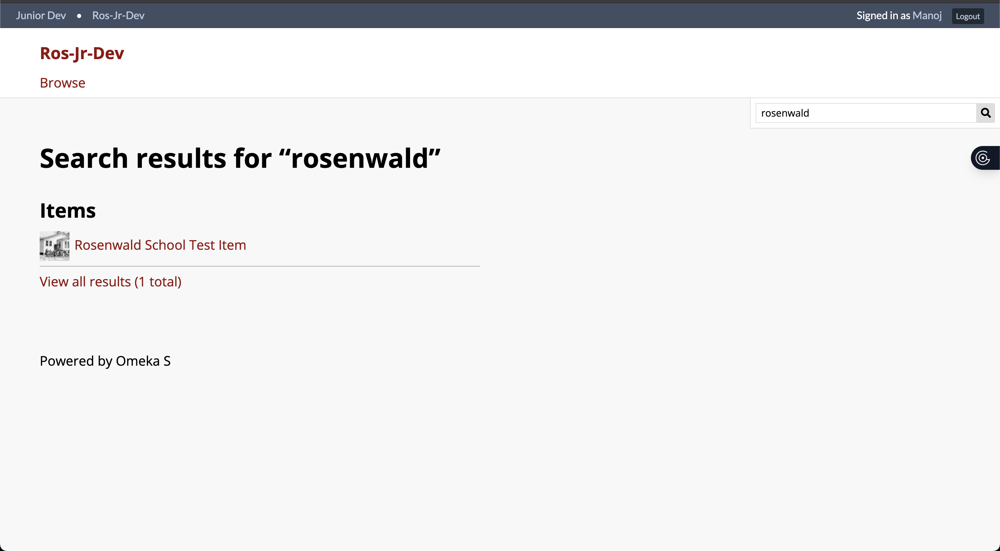
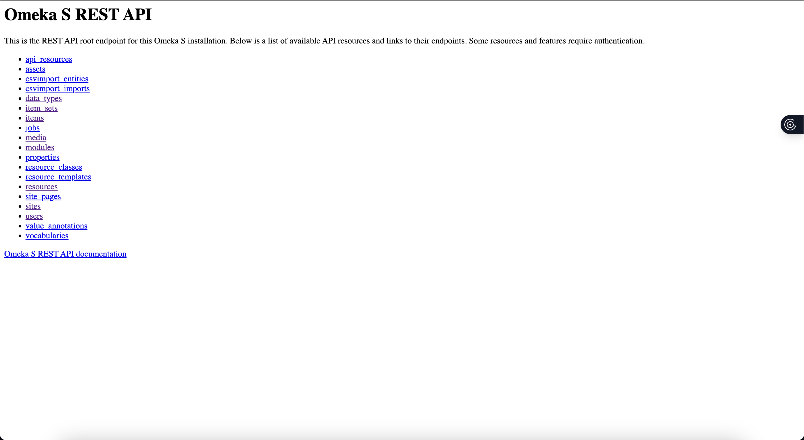

# Fall 2025 Learning Summary - Manoj

## Overview
This learning summary captures my work and reflections during the Fall 2025 roadmap (Early-September → Mid-December). With a weekly commitment of about 5 hours, my focus was on gaining practical experience and confidence across PHP, Omeka-S block development, REST API integration, and foundational cloud and CI/CD concepts. The repository contains the sandbox artifacts I used during learning, small custom blocks, templates, and notes , which show concrete experiments, decisions, and the lessons I learned along the way. For cloud and CI/CD topics this summary emphasizes conceptual understanding rather than step-by-step operational instructions.

**Code evidence in this workspace:**
- `omeka-s-custom-block/src/Site/BlockLayout/HelloWorld.php` — simple custom block example
- `omeka-s-custom-block/view/common/block-layout/hello-world.phtml` and `hello-world-form.phtml` — templates for the block
- `omeka-s-apis/src/Site/BlockLayout/ApiFilterBlock.php` — API-filtering block example
- `omeka-s-apis/view/common/block-layout/api-filter-block-form.phtml` and `api-filter-block-show.phtml` — API block templates

---

## Areas learned

Below are the concise, high-level areas I focused on during the Fall 2025 roadmap, with practical takeaways and evidence from the repository.

- PHP setup & fundamentals
	- Core language features: variables, arrays, control flow, functions, and basic error handling.
	- Evidence: template examples and PHP files in `omeka-s-custom-block` show the patterns I used for passing data into views.

- Omeka-S block development
	- Built small custom blocks to learn how Omeka-S registers modules and renders block content via `.phtml` templates.
	- Focused on separating presentation (templates) from logic (block PHP classes) and ensuring safe output in views.
	- Evidence: `omeka-s-custom-block/src/Site/BlockLayout/HelloWorld.php` and view files in the `view/common/block-layout` folders.
	

- API integration & data handling
	- Used the Omeka-S REST API to fetch items and item sets, parsed JSON responses, and normalized data for display.
	- Added filtering options to queries and formatted API results into readable HTML with basic styling.
	- Evidence: `omeka-s-apis/src/Site/BlockLayout/ApiFilterBlock.php` and the related `.phtml` templates.

	
	

- Cloud concepts, DevOps & CI/CD (merged)
	- Covered conceptual topics rather than step-by-step provisioning: cloud hosting models, instance sizing trade-offs, LAMP architecture considerations for PHP apps, IAM principles, network controls (security groups/firewalls), and configuration differences between local and hosted environments.
	- Studied CI/CD concepts: continuous integration vs continuous delivery, pipeline stages (linting, tests, static analysis, build/deploy), and how automation improves reliability and team velocity. I explored GitHub Actions as an example orchestration tool and learned about static analyzers like PHPStan/Psalm.
	- Outcome: prepared to design secure hosting strategies and CI pipelines conceptually, and to adopt them when moving from theory to practice.

---

## Key Technical Takeaways
- PHP basics.
- OOP for block logic.
- Omeka-S REST endpoints from server-side PHP.
